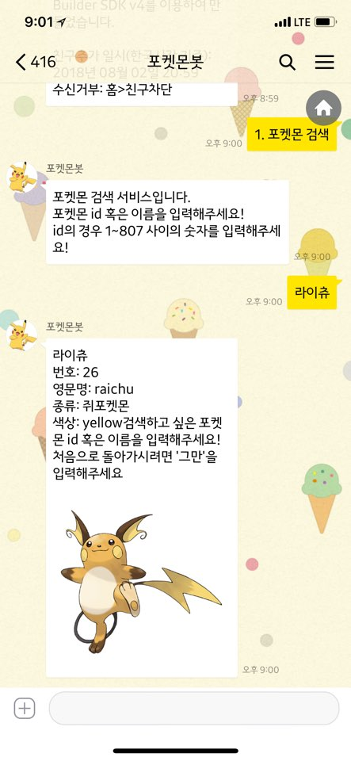

# pokebot-kakao

Microsoft의 Azure Bot Service를 이용하여 만든 챗봇을 카카오톡에서도 이용하려면 별도의 서비스를 만드셔야 합니다. (현재 Microsoft에서 기본적으로 제공하는 채널에 카카오톡이 없기 때문이죠... :( )

Azure Bot Service에서 기본으로 지원하는 채널에 대한 세부사항은 아래의 링크에서 확인할 수 있습니다. 
* [https://docs.microsoft.com/en-us/azure/bot-service/bot-service-manage-channels?view=azure-bot-service-3.0](https://docs.microsoft.com/en-us/azure/bot-service/bot-service-manage-channels?view=azure-bot-service-3.0)

Q. 그러면 카카오톡에서 내가 만든 챗봇을 사용할 수 있도록 하려면 어떻게 해야 하나요?

A. Azure Bot Service에서 공식적으로 지원하는 채널 이외에도 다양한 서비스에 Bot을 쉽게 붙일 수 있도록 [Direct Line](https://docs.microsoft.com/en-us/azure/bot-service/bot-service-channel-connect-directline?view=azure-bot-service-3.0)이라는 서비스를 제공합니다. 이 채널을 이용하여 REST API 방식으로 봇과 메세지를 주고받을 수 있어요. 그래서 이 프로젝트는 Directline을 이용하여 Azure Bot Service로 만든 봇과 소통을 하고, 카카오톡에 맞는 적절한 포멧으로 받은 메세지를 전달하고, 다시 그것을 Azure에 전달해주는 프로젝트 이지요..

## 사용방법
1. 카카오톡에서 **포켓몬봇** 검색
    

2. 친구추가
    
    
3. 대화시작
    

